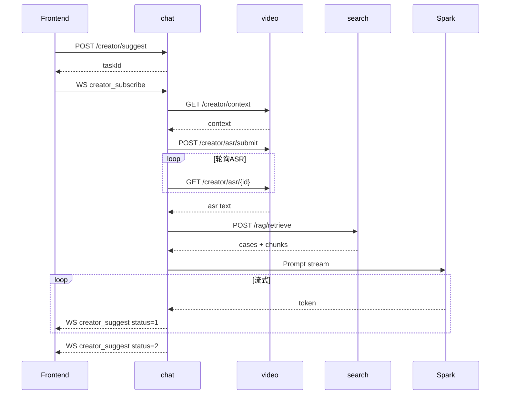

# 视频创作辅助 Agent（RAG）— 接口设计

> 版本：1.0 | 网关前缀：`/api`（前端）→ Gateway `:8200`  
> 实现进度：[progress-tracking.md](./progress-tracking.md)

---

## 1. 接口总览

| 类型 | 数量 | 说明 |
|------|------|------|
| 对外 REST | 4 | chat 模块，经 `/chat/**` |
| WebSocket | 2 种新 type | 复用现有 WS 连接 |
| 对内 Feign | 6 | search 3 + video 3 |
| 管理 Ingest | 2 | search 模块，内网/管理员 |

---

## 2. 对外 REST API（chat :1688）

Base Path：`/chat/creator`  
Gateway：`http://localhost:8200/chat/creator/**`  
鉴权：需要 JWT（`role:user`）

### 2.1 提交生成任务

**POST** `/chat/creator/suggest`

**Request Body**

```json
{
  "resumableIdentifier": "upload_abc123",
  "videoUrl": "merged-video-object-name",
  "draftTitle": "大连旅游vlog",
  "draftIntro": "记录一下这次旅行",
  "tags": ["旅游", "vlog"],
  "userId": 1001
}
```

| 字段 | 类型 | 必填 | 说明 |
|------|------|------|------|
| resumableIdentifier | string | 是* | 分片上传标识，与 videoUrl 二选一 |
| videoUrl | string | 是* | 合并后 MinIO 对象名 |
| draftTitle | string | 否 | 用户草稿标题 |
| draftIntro | string | 否 | 用户草稿简介，最大 1000 字 |
| tags | string[] | 否 | 标签 |
| userId | int | 是 | 当前登录用户 |

**Response 200**

```json
{
  "code": 200,
  "msg": "查询成功＾▽＾",
  "data": {
    "taskId": "cs_20260527143000_a1b2c3",
    "status": "PENDING",
    "estimatedSeconds": 15
  }
}
```

**幂等**：相同 `userId + resumableIdentifier` 在 5 分钟内重复请求返回已有 `taskId`。

**错误**

| HTTP | code | msg |
|------|------|-----|
| 200 | 600 | 视频尚未上传完成 |
| 200 | 600 | 请求过于频繁，请稍后再试 |
| 200 | 600 | 参数校验失败 |

---

### 2.2 查询任务状态

**GET** `/chat/creator/suggest/{taskId}?userId={userId}`

**Response 200 — 进行中**

```json
{
  "code": 200,
  "data": {
    "taskId": "cs_20260527143000_a1b2c3",
    "status": "GENERATING",
    "progress": 70,
    "partial": false,
    "result": null
  }
}
```

**Response 200 — 已完成**

```json
{
  "code": 200,
  "data": {
    "taskId": "cs_20260527143000_a1b2c3",
    "status": "COMPLETED",
    "progress": 100,
    "partial": false,
    "result": {
      "titles": ["标题1", "标题2", "标题3"],
      "intros": ["简介1", "简介2"],
      "references": [
        {
          "sourceType": "HOT_CASE",
          "title": "参考爆款标题",
          "intro": "参考简介",
          "playCount": 50000,
          "score": 0.89
        },
        {
          "sourceType": "KNOWLEDGE",
          "title": "gemini救救我.md",
          "content": "知识库片段...",
          "score": 0.82
        }
      ]
    }
  }
}
```

**status 枚举**

| 值 | 说明 |
|----|------|
| PENDING | 已创建 |
| EXTRACTING | 拉取视频上下文 |
| ASR_RUNNING | ASR 转写中 |
| ASR_DONE | ASR 完成 |
| RETRIEVING | RAG 召回中 |
| GENERATING | LLM 生成中 |
| COMPLETED | 完成 |
| PARTIAL | ASR 降级后完成 |
| FAILED | 失败 |

---

### 2.3 获取 RAG 参考来源

**GET** `/chat/creator/suggest/{taskId}/references?userId={userId}`

**Response 200**

```json
{
  "code": 200,
  "data": {
    "hotCases": [
      {
        "videoId": 12345,
        "title": "爆款标题",
        "intro": "简介",
        "playCount": 50000,
        "score": 0.89
      }
    ],
    "knowledgeChunks": [
      {
        "chunkId": "kb_001",
        "sourceFile": "gemini救救我.md",
        "content": "片段内容",
        "score": 0.82
      }
    ]
  }
}
```

---

### 2.4 采纳埋点

**POST** `/chat/creator/suggest/{taskId}/adopt`

**Request Body**

```json
{
  "userId": 1001,
  "adoptedTitle": "用户选中的标题",
  "adoptedIntro": "用户选中的简介"
}
```

**Response 200**

```json
{
  "code": 200,
  "msg": "操作成功◕‿◕",
  "data": true
}
```

---

## 3. WebSocket 协议扩展（chat）

连接：前端 dev proxy `/wschat` → Gateway `/ljl/chat` → chat `/ljl/bilibili/chat`

### 3.1 客户端 → 服务端

**订阅任务推送**

```json
{
  "type": "creator_subscribe",
  "taskId": "cs_20260527143000_a1b2c3",
  "userId": "1001"
}
```

需先发送 `init` 绑定 userId（与现有私聊流程一致）。

### 3.2 服务端 → 客户端

**流式 token（status=1 进行中）**

```json
{
  "type": "creator_suggest",
  "taskId": "cs_20260527143000_a1b2c3",
  "status": 1,
  "field": "title",
  "content": "正在生成的文字片段..."
}
```

**进度通知**

```json
{
  "type": "creator_suggest",
  "taskId": "cs_20260527143000_a1b2c3",
  "status": 0,
  "phase": "ASR_RUNNING",
  "progress": 30
}
```

**完成（status=2）**

```json
{
  "type": "creator_suggest",
  "taskId": "cs_20260527143000_a1b2c3",
  "status": 2,
  "result": {
    "titles": ["...", "...", "..."],
    "intros": ["...", "..."],
    "references": []
  }
}
```

**失败（status=-1）**

```json
{
  "type": "creator_suggest",
  "taskId": "cs_20260527143000_a1b2c3",
  "status": -1,
  "errorCode": 50001,
  "message": "LLM 调用失败"
}
```

### 3.3 现有 type 不受影响

| type | 用途 |
|------|------|
| init | 绑定 userId |
| bigmodel | 通用大模型对话 |
| message | 私聊 |
| removeSession | 清理大模型会话 |
| creator_subscribe | **新增** 订阅创作建议 |
| creator_suggest | **新增** 创作建议推送 |

---

## 4. 对内 Feign API

### 4.1 VideoClient 扩展（video :10201）

#### GET `/createCenter/creator/context`

**Query**

| 参数 | 类型 | 必填 |
|------|------|------|
| resumableIdentifier | string | 否 |
| videoUrl | string | 否 |

**Response**

```json
{
  "code": 200,
  "data": {
    "resumableIdentifier": "upload_abc",
    "videoUrl": "mergedObjectName",
    "coverBase64": "...",
    "fileName": "upload_abc",
    "merged": true,
    "durationSeconds": 0
  }
}
```

#### POST `/createCenter/creator/asr/submit`

**Request**

```json
{
  "resumableIdentifier": "upload_abc",
  "videoUrl": "mergedObjectName"
}
```

**Response**

```json
{
  "code": 200,
  "data": {
    "asrTaskId": "asr_20260527_xxx",
    "status": "RUNNING"
  }
}
```

#### GET `/createCenter/creator/asr/{asrTaskId}`

**Response — 完成**

```json
{
  "code": 200,
  "data": {
    "asrTaskId": "asr_20260527_xxx",
    "status": "COMPLETED",
    "text": "转写全文...",
    "confidence": 0.95,
    "durationSeconds": 120
  }
}
```

**status 枚举**：`PENDING` | `RUNNING` | `COMPLETED` | `FAILED`

---

### 4.2 SearchClient 扩展（search :8201）

#### POST `/search/rag/retrieve`

**Request**

```json
{
  "queryText": "ASR文本与用户草稿合并",
  "topKCase": 5,
  "topKKnowledge": 3,
  "minScore": 0.5
}
```

**Response**

```json
{
  "code": 200,
  "data": {
    "hotCases": [
      {
        "videoId": 1,
        "title": "标题",
        "intro": "简介",
        "playCount": 10000,
        "score": 0.88
      }
    ],
    "knowledgeChunks": [
      {
        "chunkId": "kb_001",
        "sourceFile": "file.md",
        "category": "运营",
        "content": "片段",
        "score": 0.75
      }
    ]
  }
}
```

#### POST `/search/rag/ingest/knowledge`

触发知识库 ingest（管理端，无 Gateway 公开路由建议）。

**Response**：`{ "ingestedChunks": 42 }`

#### POST `/search/rag/ingest/hotcases`

触发爆款案例 ingest。

**Response**：`{ "ingestedCases": 128 }`

---

## 5. DTO 清单（common 模块）

| 类名 | 包 | 用途 |
|------|-----|------|
| CreatorSuggestRequest | client.creator | 提交任务 |
| CreatorSuggestSubmitResponse | client.creator | 任务创建响应 |
| CreatorSuggestTaskResponse | client.creator | 任务查询响应 |
| CreatorSuggestResult | client.creator | 生成结果 |
| CreatorReferenceItem | client.creator | 参考来源项 |
| CreatorAdoptRequest | client.creator | 采纳埋点 |
| RagRetrieveRequest | client.creator | RAG 召回请求 |
| RagRetrieveResponse | client.creator | RAG 召回响应 |
| HotCaseItem | client.creator | 爆款案例 |
| KnowledgeChunkItem | client.creator | 知识库片段 |
| VideoContextResponse | client.creator | 上传上下文 |
| AsrSubmitRequest | client.creator | ASR 提交 |
| AsrTaskResponse | client.creator | ASR 状态 |

---

## 6. 错误码

| code | 模块 | 含义 | 用户提示 |
|------|------|------|----------|
| 40001 | chat | 视频尚未上传完成 | 请先完成视频上传 |
| 40002 | chat | ASR 超时（已降级） | 未能识别语音，已基于草稿生成 |
| 40003 | chat | RAG 无召回 | 未找到相似案例，已直接生成 |
| 42901 | chat | LLM QPS 超限 | 排队中，请稍候 |
| 50001 | chat | LLM 调用失败 | 生成失败，请重试 |
| 50002 | video | ASR 服务不可用 | 语音识别暂不可用 |
| 50003 | search | Embedding 失败 | 检索服务异常 |

统一 HTTP 200 + `Result.code` 模式（与项目现有 `Result` 一致）。

---

## 7. 时序图

### 7.1 完整成功路径



### 7.2 幂等逻辑

```
Key = creator:idempotent:{userId}:{resumableIdentifier}
TTL = 5 minutes
若 Key 存在 → 返回已有 taskId
否则 → 创建任务并写入 Key
```

---

## 8. 前端 API 封装（vue）

文件：`vue/labilibili/src/api/creator.js`

| 方法 | 对应接口 |
|------|----------|
| submitCreatorSuggest(data) | POST /chat/creator/suggest |
| getCreatorSuggestTask(taskId, userId) | GET /chat/creator/suggest/{taskId} |
| getCreatorReferences(taskId, userId) | GET .../references |
| adoptCreatorSuggest(taskId, data) | POST .../adopt |

WebSocket 订阅逻辑放在 `CreatorSuggestPanel.vue` 组件内。

---

## 9. 版本与兼容

- v1.0：MVP，REST + WS 双通道
- 后续 v1.1：可增加 SSE 替代 WS 用于仅 HTTP 环境
- Feign URL 保持 `localhost` 硬编码，与项目现有 Client 一致

---

## 附录 A. 实现配置清单

详细凭证填写、环境变量与验收步骤见 [`config-guide.md`](./config-guide.md)。

| 服务 | 配置前缀 | 说明 |
|------|----------|------|
| chat | `creator.xunfei.spark` | 星火多凭证池 |
| video | `creator.xunfei.asr` | LFASR 转写 |
| search | `creator.xunfei.embedding` + `creator.rag.embedding-provider` | 向量与 ingest 鉴权 |

前端 `creator.js` 使用 `creatorRequest` 解析完整 `Result`；`CreatorSuggestPanel` 支持 WS 流式分栏与 2s 轮询兜底。
