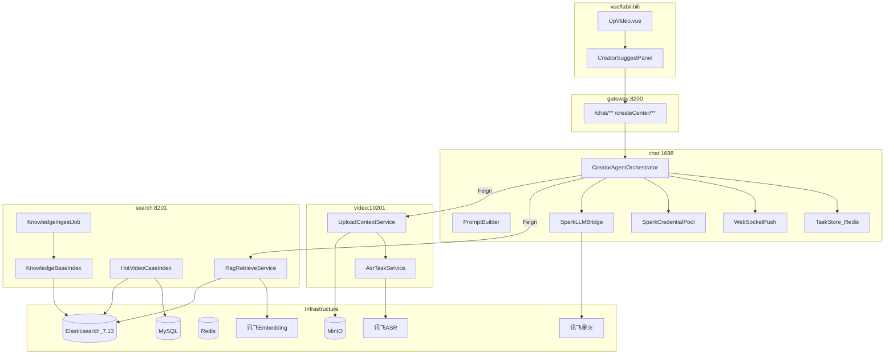
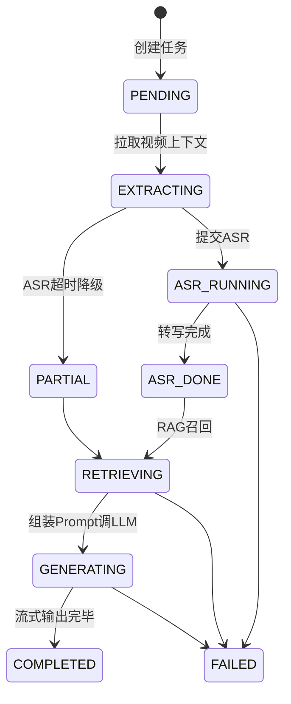

# 视频创作辅助 Agent（RAG）— 架构设计

> 版本：1.0 | 状态：**MVP 已编码**（进度见 [progress-tracking.md](./progress-tracking.md)） | 对齐模块：search / chat / video / common / vue

---

## 1. 需求拆解

### 1.1 业务背景

创作者在视频上传页（`UpVideo.vue`）完成分片上传后，需手动撰写标题与简介。该环节耗时长、质量不稳定，且缺乏平台爆款案例参考。

### 1.2 产品目标

| 目标 | 说明 |
|------|------|
| 智能建议 | 结合视频 ASR 文本、用户草稿、RAG 召回的爆款案例与本地知识库，生成 3 条标题 + 2 条简介 |
| 可追溯 | 展示参考来源（爆款标题、播放量、知识库片段） |
| 流式体验 | WebSocket 流式推送，不阻塞上传主链路 |
| 工程化 | 凭证池突破 LLM QPS 限制；ASR/RAG 失败可降级 |

### 1.3 成功指标（MVP）

- 点击「AI 生成建议」→ 首 token ≤ 8s（P95）
- 建议采纳率 ≥ 30%（上线后埋点）
- RAG Top-5 中至少 1 条语义相关（人工抽检）

### 1.4 用户故事

| ID | 场景 | 验收标准 |
|----|------|----------|
| US-01 | 上传合并完成后点击 AI 生成 | 流式展示建议，一键填入表单 |
| US-02 | 已有部分草稿 | 在草稿基础上优化 |
| US-03 | 查看参考依据 | 展示爆款案例列表 |
| US-04 | 运营维护知识库 | 离线 ingest 后可检索 |
| US-05 | 多用户并发 | 凭证池调度 + 限流提示 |

### 1.5 功能范围

**In Scope（MVP）**

- 讯飞 ASR 异步转写（含降级）
- 双源 RAG：爆款视频案例 + 本地知识库
- Agent 编排 + 星火 LLM 生成
- REST 任务 API + WebSocket 流式推送
- 上传页 UI 集成

**Out of Scope**

- 自动替用户调用 `uploadTotal` 发布
- 多模态 VL 视觉理解
- 新建独立 `creator-agent` 微服务

---

## 2. 架构原则与服务边界

### 2.1 设计原则

1. **高内聚**：RAG 索引/检索 → `search`；Agent/LLM/WS → `chat`；视频/ASR → `video`
2. **低耦合**：跨服务仅通过 `common` 中 Feign + DTO 通信
3. **不破坏现有架构**：不修改 `UploadAndEditController` 核心上传逻辑；ES 关键词索引与 RAG 索引物理隔离；WebSocket 扩展新 `type`

### 2.2 模块职责矩阵

| 模块 | 包路径 | 职责 | 复用 |
|------|--------|------|------|
| search | `ljl.bilibili.search.rag` | 向量索引、知识库/爆款 ingest、召回 API | ES 7.13、XXL-Job、Redis |
| chat | `ljl.bilibili.chat.creator` | Agent 编排、Prompt、任务状态、LLM、WS 推送 | BigModelHandler、WebSocket |
| video | `ljl.bilibili.video.creator` | 上传上下文、ASR 任务 | MinIO、JAVE 首帧、uploadPartMap |
| common | `ljl.bilibili.client.creator` | 共享 DTO、Feign 接口 | Result |
| gateway | — | 复用 `/chat/**`、`/createCenter/**` 路由 | JWT |
| vue | `CreatorSuggestPanel` | AI 入口、WS 订阅 | upLoad、axios |

### 2.3 模块依赖图



---

## 3. 技术栈与依赖

### 3.1 沿用栈

| 类别 | 选型 |
|------|------|
| 运行时 | Java 8 + Spring Boot 2.6.11 |
| 网关 | Spring Cloud Gateway :8200 |
| 向量存储 | Elasticsearch 7.13.3（不升级） |
| 对象存储 | MinIO |
| 缓存 | Redis |
| 定时任务 | XXL-Job（search 模块） |
| LLM | 讯飞星火 WebSocket v3.5 |
| 实时 | WebSocket（chat 模块） |
| 前端 | Vue 3 + Element Plus |

### 3.2 新增外部 API

| API | 用途 | 调用方 |
|-----|------|--------|
| 讯飞 ASR | 视频语音转写 | video |
| 讯飞 Embedding | 文本向量化 | search |
| 讯飞星火 Chat | 标题/简介生成 | chat |

### 3.3 新增 Maven 依赖

**search**

- `org.apache.tika:tika-core:2.9.1`
- `org.apache.tika:tika-parsers-standard-package:2.9.1`

**chat**

- `spring-boot-starter-data-redis`

**video**

- 无 heavy 新依赖（OkHttp 经 common/hutool 已有）

### 3.4 ES 7.13 向量检索

- 索引：`creator_knowledge`、`creator_video_case`
- 字段：`content_vector`（dense_vector, dims=256，本地 Embedding 维度）
- 检索：`script_score` + `cosineSimilarity`（ES 7.x 标准方案）
- 与现有 `video` 关键词索引**物理隔离**

---

## 4. 核心实现链路

### 4.1 离线 Ingest

**知识库（XXL-Job + 手动 API）**

1. 扫描 `知识库/`（.md / .pdf / .txt）
2. Tika 提取文本 → 500 字切片，50 字 overlap
3. Embedding → 写入 `creator_knowledge`

**爆款案例（XXL-Job 每日）**

1. MySQL 联表 `video` + `video_data`，`play_count >= 10000`
2. 拼接 title + intro → Embedding → 写入 `creator_video_case`

### 4.2 在线 Agent 编排（chat）



**Prompt 模板**（`chat/src/main/resources/prompts/creator-suggest.txt`）

```
[System] 你是 MirrorSea 平台爆款视频运营专家...
[Context-RAG-案例] Top5 相似爆款
[Context-RAG-知识库] Top3 运营规范片段
[User-Video] ASR文本 + 草稿 + 文件名
[Task] 输出 JSON: titles[3], intros[2]
```

**凭证池（Redis）**

- Key 前缀：`spark:credential:`
- 流程：取 idle 凭证 → busy → 调 LLM → release（TTL 60s 兜底）

### 4.3 ASR 流程（video）

1. 接收 `resumableIdentifier` / `videoUrl`
2. 从 uploadPartMap 或 MinIO 获取已合并视频
3. 提交 ASR 异步任务 → `asrTaskId`
4. chat 轮询或 video 写 Redis 完成态
5. 超时 120s → 降级 PARTIAL（文件名 + 草稿继续 RAG）

---

## 5. 数据模型

### 5.1 ES `creator_knowledge`

```json
{
  "chunk_id": "kb_gemini_001",
  "source_file": "gemini救救我.md",
  "category": "运营规范",
  "content": "文本片段",
  "content_vector": [0.12, "..."],
  "updated_at": "2026-05-27T00:00:00Z"
}
```

### 5.2 ES `creator_video_case`

```json
{
  "video_id": 12345,
  "title": "爆款标题",
  "intro": "简介",
  "play_count": 50000,
  "like_count": 3000,
  "content": "title + intro 合并检索文本",
  "content_vector": [0.34, "..."]
}
```

### 5.3 Redis 任务状态

Key：`creator:task:{taskId}`，TTL 24h

```json
{
  "status": "GENERATING",
  "userId": 1001,
  "progress": 70,
  "partial": false,
  "errorCode": null
}
```

### 5.4 MySQL `creator_suggest_log`（chat）

权威 DDL 见项目根目录 [`sql.sql`](../../sql.sql)（`chat_session` 之后），与全库脚本一并初始化，不在 chat 模块单独维护 SQL 文件。

逻辑依赖：`user_id` → `user.id`（无物理外键，与同库其它表一致）；`task_id` → Redis `creator:task:{taskId}`；`resumable_identifier` → 上传幂等标识（可选）。

| 字段 | 类型 | 说明 |
|------|------|------|
| id | BIGINT PK | 自增 |
| task_id | VARCHAR(64) | 任务 ID |
| user_id | INT | 用户 |
| resumable_identifier | VARCHAR(128) | 上传标识 |
| input_snapshot | TEXT | 输入 JSON |
| output_snapshot | TEXT | 输出 JSON |
| adopted_title | VARCHAR(256) | 采纳标题 |
| adopted_intro | VARCHAR(1000) | 采纳简介 |
| created_at | DATETIME | 创建时间 |

---

## 6. 配置项

### search `application.yml`

```yaml
creator:
  rag:
    knowledge-dir: ../知识库
    embedding-dims: 256
    hot-case-play-threshold: 10000
    chunk-size: 500
    chunk-overlap: 50
  xunfei:
    embedding-app-id: ${XUNFEI_APP_ID:xxx}
    embedding-api-key: ${XUNFEI_API_KEY:xxx}
    embedding-api-secret: ${XUNFEI_API_SECRET:xxx}
```

### video `application.yml`

```yaml
creator:
  asr:
    timeout-seconds: 120
    max-audio-seconds: 300
  xunfei:
    asr-app-id: ${XUNFEI_APP_ID:xxx}
    asr-api-key: ${XUNFEI_API_KEY:xxx}
    asr-api-secret: ${XUNFEI_API_SECRET:xxx}
```

### chat `application.yml`

```yaml
spring:
  redis:
    host: localhost
creator:
  suggest:
    idempotent-minutes: 5
    rate-limit-per-minute: 3
  xunfei:
    credentials:
      - appId: xxx
        apiKey: xxx
        apiSecret: xxx
```

---

## 7. 非功能需求

| 维度 | 要求 |
|------|------|
| 鉴权 | Gateway JWT；任务与 userId 绑定 |
| 幂等 | 同 resumableIdentifier 5min 内返回已有 taskId |
| 限流 | 单用户 3 次/分钟；凭证池控 LLM 并发 |
| 降级 | ASR 失败 → PARTIAL；RAG 空 → 纯 LLM |
| 安全 | 草稿长度截断；ingest API 仅内网 |
| 可观测 | 各阶段耗时日志；可选 Zipkin |

---

## 8. 实施阶段

| 阶段 | 内容 | 模块 | 状态 |
|------|------|------|------|
| P0 | ES 索引 + ingest + retrieve | search | ✅ 已完成 |
| P1 | ASR + 上传上下文 API | video | ✅ 已完成 |
| P2 | Agent + REST/WS + 凭证池 | chat | ✅ 已完成 |
| P3 | UpVideo UI | vue | ✅ 已完成 |
| P4 | 联调与性能调优 | 全链路 | ⏳ 待密钥与 ingest 验收 |

> 明细与验收项：[progress-tracking.md](./progress-tracking.md)

---

## 9. 风险与缓解

| 风险 | 缓解 |
|------|------|
| ES 7.13 向量性能 | TopK≤8；keyword 预过滤 |
| ASR 长视频慢 | 仅前 5min 音频；异步 + 进度 |
| chat 模块膨胀 | 严格 `creator/` 子包隔离 |
| 讯飞 QPS/成本 | 凭证池 + 队列 + 限流 |
| Gateway WS 路径 | 前端 `/wschat` → Gateway → chat |

---

## 10. 目录结构（新增）

```
java/common/.../client/creator/          # DTO + Feign
java/search/.../rag/                   # RAG 全链路
java/video/.../creator/                # 上下文 + ASR
java/chat/.../creator/                 # Agent 编排
docs/creator-agent/                    # 设计文档 + progress-tracking.md
vue/labilibili/src/components/creator/ # CreatorSuggestPanel
vue/labilibili/src/api/creator.js      # API 封装
```
